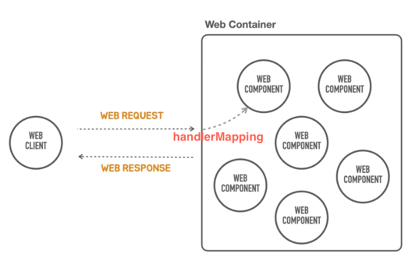
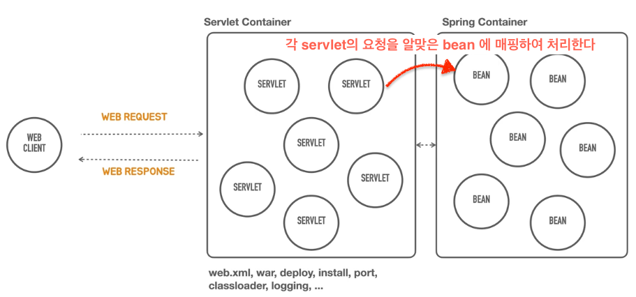
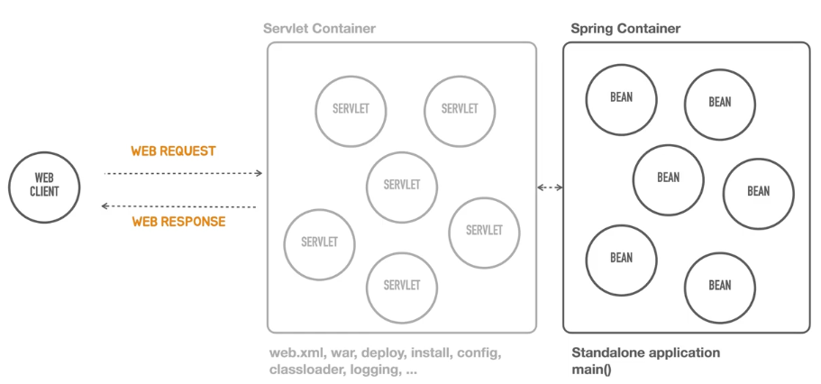

- web Component : 클라이언트의 요청을 동적으로 처리한다.
- handler mapping : web request 를 어떤 web component 에게 할당/위임 할 것인지 정하는 것
- java 에서는 web component 를 servlet 으로 부른다.
- 가장 유명한 servlet container: 톰캣
- 여기까지가 90년대 후반까지 유지된 전통적인 자바 웹 프로그래밍 방식

### 기존 스프링 방식

- 우리는 스프링 컨테이너에만 집중해서 개발을 하고 싶은데, 그게 쉽지 않아. 
- servlet container 를 띄워야만 spring container 도 띄울 수 있다.
- 즉 servlet container 를 띄우기 위해서 수많은 설정을 해야함. -> servlet container 가 담당하는 deploy, port, classloader, logging 등 신경쓸게 넘 많다. 
- 개발하고자 하는 비즈니스 로직에만 집중할 수 없는 상황 

### `containerless` 개발
- springboot application 의 run() 실행만으로 servlet container 도 함께 실행할 수 있는 것.
- servlet container 의 별도 복잡한 설정 없이도 spring application 을 실행
