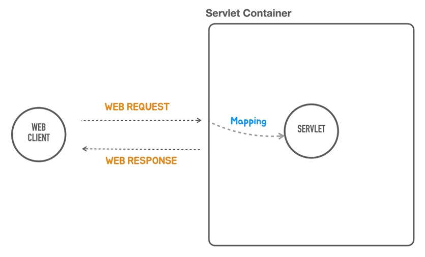

``` java
public class PrincipleApplication {
	public static void main(String[] args) {
		System.out.println("Start from bottom of springboot");
	}
}
```
- 이 상태에서 Springboot 의 컨트롤러를 실행시켜보자.

## 서블릿 컨테이너 띄우기
- 원래는 embedded tomcat 이 내장돼 있다.

```java
public class PrincipleApplication {
	public static void main(String[] args) {
		System.out.println("Start from bottom of springboot");
		ServletWebServerFactory tomcatServletWebServerFactory = new TomcatServletWebServerFactory();
		WebServer webServer = tomcatServletWebServerFactory.getWebServer();
		// tomcat 이나 jetty 같은 servlet 을 생성하는 과정
		webServer.start(); // tomcat servlet container 가 실행된다.
		// servlet 을 띄울 컨테이너를 먼저 생성한 것.
		// servlet 은 자바에서 지원하는 표준 기술
	}
}
```


- 빈 서블릿 컨테이너를 띄운 상태다. 이제 컨테이너 내부에 필요한 servlet 을 생성해서 띄운다.
- 서블릿 컨테이너 안에 들어가는 웹 컴포넌트를 서블릿 이라 부른다.


- 서블릿 컨테이너 내부에는 여러 서블릿이 존재하는데 웹 요청에 맞는 서블릿을 찾는 것을 mapping 이라 한다.

```java
public class PrincipleApplication {
    public static void main(String[] args) {
        System.out.println("Start from bottom of springboot");
        ServletWebServerFactory tomcatServletWebServerFactory = new TomcatServletWebServerFactory();
        WebServer webServer = tomcatServletWebServerFactory.getWebServer(servletContext -> {
            servletContext.addServlet("hello", new HttpServlet() {
                @Override
                public void service(HttpServletRequest req, HttpServletResponse res) throws ServletException, IOException {
                    String name = req.getParameter("name");
                    // web response 의 3가지 요소 : status code, header, body
                    res.setStatus(HttpStatus.OK.value()); // status code
                    res.setHeader(HttpHeaders.CONTENT_TYPE, MediaType.TEXT_PLAIN_VALUE); // header
                    res.getWriter().println("Hello Servlet"); // body
                    res.getWriter().println("hello " + name);
                }
            }).addMapping("/hello"); // "/hello" 로 들어오는 요청이 있으면 여기서 익명클래스로 만든 오브젝트가 처리하겠다는 의미.
        });
        webServer.start(); // tomcat servlet container 가 실행된다.
    }
}
```

- 별도의 톰캣설정 없이, 간단한 코드로 서블릿 컨테이너와 서블릿 매핑까지 구현하여 서버로부터 응답을 받았다.


- 여러 서블릿이 있다면, 각 서블릿이 필요로 하는 공통적인 로직을 매번 작성해야했다. 요청이 100가지 정도 있다면 비슷한 코드가 100개의 서블릿에 존재한 격.
- 서블릿은 요청과 응답을 담당하는데 집중해야한다.
- 모든 서블릿에 등장하는 공통적인 작업을 담당하는 오브젝트를 별도로 만들자. 그리고 그 오브젝트에서 공통적인 작업등 모든 웹 요청에서 처리해야하는 작업을 담당.

```java
public class PrincipleApplication {
	public static void main(String[] args) {
		System.out.println("Start from bottom of springboot");
		ServletWebServerFactory tomcatServletWebServerFactory = new TomcatServletWebServerFactory();
		WebServer webServer = tomcatServletWebServerFactory.getWebServer(servletContext -> {

			HelloController helloController = new HelloController();
			servletContext.addServlet("frontController", new HttpServlet() {
				@Override
				public void service(HttpServletRequest req, HttpServletResponse res) throws ServletException, IOException {
					// 매핑과 바인딩을 담당 -> 매핑은 웹 uri 의 정보를 가지고 어떤 로직을 수행하는 코드를 호출할지 결정하는 과정
					// 인증, 보안, 다국어, 공통 기능 -> front controller 가 담당
					if (req.getRequestURI().equals("/hello") && req.getMethod().equals(HttpMethod.GET.name())) {
						String name = req.getParameter("name");
						String hello = helloController.hello(name); // 복잡한 로직()은 hello() 메서드 내에 모두 옮겼다.
						res.setStatus(HttpStatus.OK.value());
						res.setHeader(HttpHeaders.CONTENT_TYPE, MediaType.TEXT_PLAIN_VALUE);
						res.getWriter().println(hello);
					} else if (req.getRequestURI().equals("/user")) {
						//
					} else {
						res.setStatus(HttpStatus.NOT_FOUND.value());
					}

				}
			}).addMapping("/*");
		});
		webServer.start();
	}
}

```
- 스프링을 전혀 사용하지 않고 서블릿만 활용하여 프론트 컨트롤러 까지 생성했다. 메인 메서드에서 시작하여 컨테이너를 띄우고 요청 url 에 맞는 로직을 매핑했다.