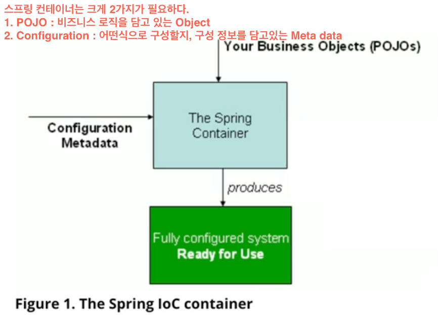
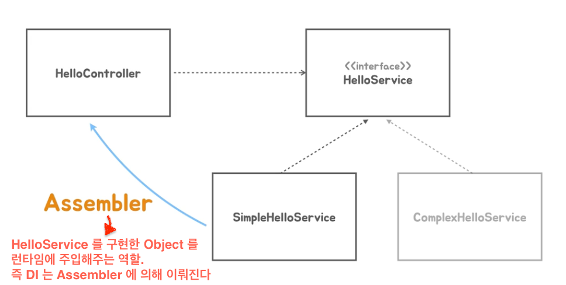
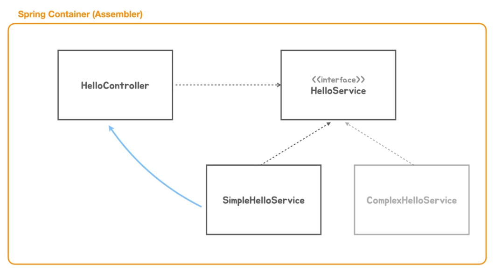

``` java
public class PrincipleApplication {
    public static void main(String[] args) {
        // spring container 를 만들어 보자.
        GenericApplicationContext applicationContext = new GenericApplicationContext();// 얘가 결국 스프링컨테이너가 된다.
        // 스프링 컨테이너는 오브젝트를 직접 생성하여 넣어 줄 수 도 있지만,
        // 어떤 클래스를 이용해서 빈 오브젝트를 생성할 것인가 라는 메타정보를 넣어 주는 방식으로 구성할 수 있다.
        applicationContext.registerBean(HelloController.class); // object 를 넘기는 것이 아니라 클래스 정보만 넘긴다.
        applicationContext.refresh(); // container 를 초기화

        ServletWebServerFactory tomcatServletWebServerFactory = new TomcatServletWebServerFactory();
        WebServer webServer = tomcatServletWebServerFactory.getWebServer(servletContext -> {
            servletContext.addServlet("frontController", new HttpServlet() {
                @Override
                public void service(HttpServletRequest req, HttpServletResponse res) throws ServletException, IOException {
                    if (req.getRequestURI().equals("/hello") && req.getMethod().equals(HttpMethod.GET.name())) {
                        String name = req.getParameter("name");
                        HelloController helloController = applicationContext.getBean(HelloController.class);
                        String hello = helloController.hello(name);
                        // application context 는 HelloController 라는 타입의 빈이 어떻게 생성됐는지는 알지 못해도 상관없다. 그저 가져다 사용만 할 뿐이다.
                        res.setContentType(MediaType.TEXT_PLAIN_VALUE);
                        res.getWriter().println(hello);
                    } else {
                        res.setStatus(HttpStatus.NOT_FOUND.value());
                    }

                }
            }).addMapping("/*"); // "/hello" 로 들어오는 요청이 있으면 여기서 익명클래스로 만든 오브젝트가 처리하겠다는 의미.
        });
        webServer.start(); // tomcat servlet container 가 실행된다.
    }
}
```
- 굳이 spring container 를 통해 HelloController 를 만들어야 하는 이유가 뭘까? 이전 처럼 new 연산자로 HelloController 오브젝트를 생성하면 되는 것 아닐까?
- 이점 : spring container 는 어떤 타입의 오브젝트를 만들 때 딱 한번만 만든다.
- Servlet Container 외에 다른 곳에서도 HelloController 를 사용하고 싶을 때, Spring Container 는 최초 한번 만들어둔 HelloContainer 를 그대로 반환한다.
- 즉 HelloController 를 필요하는 모든 곳에서는 결국 동일한 object 를 가져다 쓰는 격이다.
- 스프링 컨테이너는 싱글톤 패턴을 사용하지 않고도 객체를 딱 한번만 만들어 재사용할 수 있게 한다. 그래서 스프링 컨테이너를 싱글톤 레지스트리 라고도 부른다.
 
### Dependency Injection
- HelloController -> SimpleHelloService : HelloController 가 SimpleHelloService 를 의존한다.
- 이말이 무슨 말이냐, SimpleHelloService 가 변경되면 HellocController 는 영향을 받는다. 이걸 의존관계가 있다고 표현한다.


- 코드상으로 보면 HelloController 는 HelloService Interface 에 의존하는 것 처럼 보인다.
- 런타임에는 실제로 HelloController 가 의존할 구현 클래스(SimpleHelloService or ComplexHelloService)를 지정해줘야 한다.
- 내가 어느 클래스의 오브젝트를 사용할 것인지 정해져야 한다.
- HelloController 와 SimpleHelloService 의 연관관계를 만드는 것, 이 작업을 `Dependency Injection` 이라 부른다.
- `Dependency Injection` 에는 `Assembler` 라는 제 3의 존재가 필요하다.
- HelloController 가 사용할 Service 를 new 연산자로 내부에서 직접 생성하는 것이 아닌 외부에서 주입하도록 도와주는 역할을 Assembler 가 맡는다.
- 이 Assembler 를 우리는 `Spring Container` 라 부른다.

- 주입을 해준다 -> SimpleHelloService 의 reference 를 넘겨준다 라는 의미.
- 인터페이스를 통해 간접적으로 의존관계를 맺고 코드상의 명시적인 의존관계는 지운다.

```java
public class PrincipleApplication {
    public static void main(String[] args) {
        GenericApplicationContext applicationContext = new GenericApplicationContext();
        applicationContext.registerBean(HelloController.class);
        applicationContext.registerBean(SimpleHelloService.class); // HelloService 를 구현한 빈을 등록한다.

        applicationContext.refresh();
        ...
    }
}
```

- 두개의 오브젝트가 빈으로 등록되는데 둘 사이의 관계는 어떻게 맺어지는 걸까?
- 바로 스프링컨테이너가 이를 도와준다. HelloController 생성자는 HelloService 인터페이스를 필요로 하기 때문에 해당 인터페이스를 구현한 클래스가 런타임때 필요하다.
- 스프링 컨테이너는 HelloController 를 생성할 때 필요한 HelloService 타입의 구체 클래스로 등록된 빈을 찾아 이를 (생성자에) 주입해준다.

### DispatcherServlet
- 매핑과 바인딩 역할을 한다. (위에서 FrontController 가 하던 역할)
- FrontController 에서 매번 일일이 매핑과 바인딩 작업을 처리하지 않고 DispatcherServlet 에게 위임한다.
- DispatcherServlet 을 생성하고 스프링 컨테이너에 등록된 빈 정보를 넘기도록 applicationContext 를 인자로 넣는다.

````java
public class PrincipleApplication {
    public static void main(String[] args) {
        GenericWebApplicationContext applicationContext = new GenericWebApplicationContext();
        applicationContext.registerBean(HelloController.class);
        applicationContext.registerBean(SimpleHelloService.class); // HelloService 를 구현한 빈을 등록한다.
        applicationContext.refresh();

        ServletWebServerFactory tomcatServletWebServerFactory = new TomcatServletWebServerFactory();
        WebServer webServer = tomcatServletWebServerFactory.getWebServer(servletContext -> {
            servletContext.addServlet("dispatcherServlet",
                new DispatcherServlet(applicationContext))
                .addMapping("/*");
        });
        webServer.start(); // tomcat servlet container 가 실행된다.
    }
}
````

````java

@RequestMapping
public class HelloController {

    private final HelloService helloService;

    public HelloController(HelloService helloService) {
        this.helloService = helloService;
    }

    @GetMapping("/hello")
    public String hello(String name) {
        return helloService.sayHello(name);
    }
}
````
- DispatcherServlet 이 매핑 정보를 만들 때 @RequestMapping 이 붙은 클래스를 통해 web 요청을 처리할 수 있는 메서드를 찾는다. 
```java
public class PrincipleApplication {
    public static void main(String[] args) {
        // (1)
        GenericWebApplicationContext applicationContext = new GenericWebApplicationContext();
        applicationContext.registerBean(HelloController.class);
        applicationContext.registerBean(SimpleHelloService.class);
        applicationContext.refresh(); // spring container 의 초기화

        // (2) ServletContainer 를 코드롤 등록하면서 servlet 을 실행한다.
        ServletWebServerFactory tomcatServletWebServerFactory = new TomcatServletWebServerFactory();
        WebServer webServer = tomcatServletWebServerFactory.getWebServer(servletContext -> {
            servletContext.addServlet("dispatcherServlet",
                new DispatcherServlet(applicationContext))
                .addMapping("/*");
        });
        webServer.start();
    }
}
```
- 전체적으로 코드가 간결해졌다.
- (1) 스프링 컨테이너 생성과 스프링 빈을 등록, (2) ServletContainer 를 등록하고 servlet 을 실행한다.

### 자바 코드로 구성 정보 사용
- 팩토리 메서드를 만들어서 직접 Bean instance 를 생성하는 방법
```java
@Configuration
public class PrincipleApplication {

    @Bean
    public HelloController helloController(HelloService helloService) {
        return new HelloController(helloService);
    }

    @Bean
    public HelloService helloService() {
        return new SimpleHelloService();
    }

    public static void main(String[] args) {

        // java code 로 만든 configuration 을 읽을 수 있도록 AnnotationConfigWebApplicationContext 선언
        AnnotationConfigWebApplicationContext applicationContext = new AnnotationConfigWebApplicationContext() {
            @Override
            protected void onRefresh() {
                super.onRefresh();
                // servlet container 를 초기화하는 코드를 여기로 옮긴다. -> spring container 가 실행될 때 서블릿 컨테이너도 내재화 하여 같이 실행되게 함
                ServletWebServerFactory tomcatServletWebServerFactory = new TomcatServletWebServerFactory();
                WebServer webServer = tomcatServletWebServerFactory.getWebServer(servletContext -> {
                    servletContext.addServlet("dispatcherServlet",
                            new DispatcherServlet(this))
                        .addMapping("/*");
                });
                webServer.start();
            }
        };
        
        // java code 로 된 구성정보를 가진 클래스를 등록해줘야 한다.
        applicationContext.register(PrincipleApplication.class);
        applicationContext.refresh();
    }
}
```


### @ComponentScan 으로 빈 구성 찾기
- 위에서 자바 코드로 등록한 빈 대신 @Component 어노테이션이 붙은 클래스를 모두 찾아 빈으로 등록한다.
- @ComponentScan 어노테이션 덕분에 @Component 가 붙은 모든 클래스를 찾을 수 있다.
- 아래 코드는 스프링 컨테이너가 실행될 때 서블릿 컨테이너도 같이 실행되는 형태
```java
@Configuration
@ComponentScan
public class PrincipleApplication {
    public static void main(String[] args) {
        AnnotationConfigWebApplicationContext applicationContext = new AnnotationConfigWebApplicationContext() {
            @Override
            protected void onRefresh() {
                super.onRefresh();
                ServletWebServerFactory tomcatServletWebServerFactory = new TomcatServletWebServerFactory();
                WebServer webServer = tomcatServletWebServerFactory.getWebServer(servletContext -> {
                    servletContext.addServlet("dispatcherServlet",
                            new DispatcherServlet(this))
                        .addMapping("/*");
                });
                webServer.start();
            }
        };

        applicationContext.register(PrincipleApplication.class);
        applicationContext.refresh();
    }
}
```