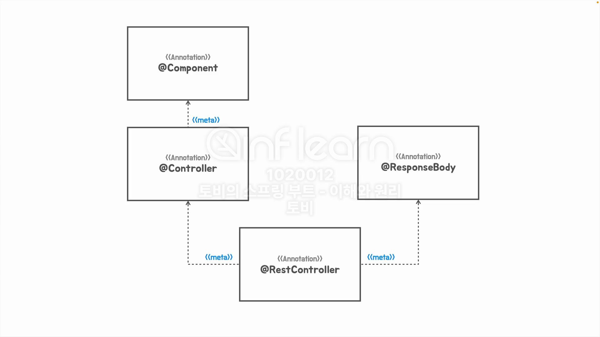
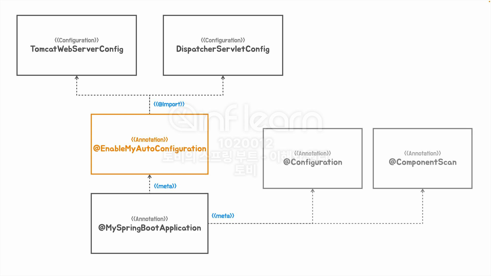

## 간단한 메타 어노테이션 만드는 법



```java
@Retention(RetentionPolicy.RUNTIME)
@Target({ElementType.METHOD})
@UnitTest
@interface FastTest { }

@Retention(RetentionPolicy.RUNTIME)
@Target({ElementType.ANNOTATION_TYPE, ElementType.METHOD})
@Test
@interface UnitTest { }

class SimpleHelloServiceTest {

    @UnitTest
    void simpleHelloService() {
        ...
    }

    @Test
    void helloDecorator() {
        ...
    }

}
```

## 인프라 빈 구성 정보의 분리

기존에는 @Configuration 어노테이션이 붙은 Config 클래스 내부에 `DispatcherServletConfig`, `TomcatWebServerConfig` Bean 을 등록해서 사용했다.
이 방법은 새로운 설정 Bean 이 추가될 때 마다 Config 클래스가 비대해지는 문제가 있기 때문에 각각의 Bean 을 개별 클래스로 분리하기로 결정한다.
분리된 개별 설정 파일은 ComponentScan 의 대상을 벗어나는 패키지에 위치해 있지만, @Import 어노테이션을 사용하면 ComponentScan 대상 범위에 상관없이 Bean 을 등록할 수 있다.
이제 자동 구성 Configuration Bean 은 모두 @EnableMyAutoConfiguration 합서 어노테이션에서 @Import 로 가져오도록 설정된 셈이다.