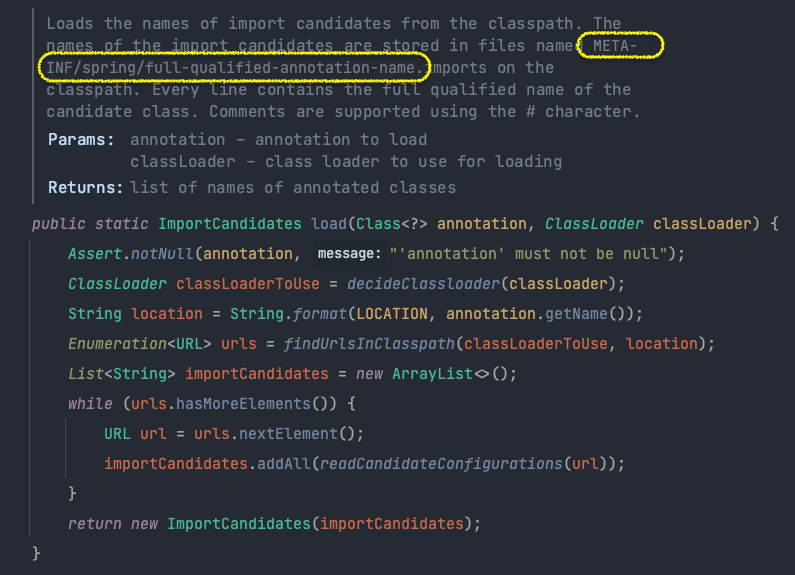
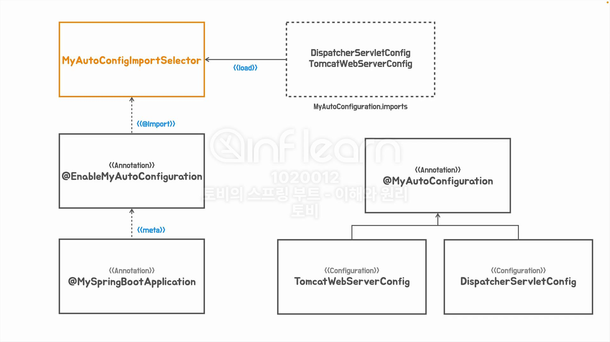

## 간단한 메타 어노테이션 만드는 법


```java
@Retention(RetentionPolicy.RUNTIME)
@Target({ElementType.METHOD})
@UnitTest
@interface FastTest { }

@Retention(RetentionPolicy.RUNTIME)
@Target({ElementType.ANNOTATION_TYPE, ElementType.METHOD})
@Test
@interface UnitTest { }

class SimpleHelloServiceTest {

    @UnitTest
    void simpleHelloService() {
        ...
    }

    @Test
    void helloDecorator() {
        ...
    }

}
```

<hr/>

### 24.05.20

## 인프라 빈 구성 정보의 분리

기존에는 @Configuration 어노테이션이 붙은 Config 클래스 내부에 `DispatcherServletConfig`, `TomcatWebServerConfig` Bean 을 등록해서 사용했다.
이 방법은 새로운 설정 Bean 이 추가될 때 마다 Config 클래스가 비대해지는 문제가 있기 때문에 각각의 Bean 을 개별 클래스로 분리하기로 결정한다.
분리된 개별 설정 파일은 ComponentScan 의 대상을 벗어나는 패키지에 위치해 있지만, @Import 어노테이션을 사용하면 ComponentScan 대상 범위에 상관없이 Bean 을 등록할 수 있다.
이제 자 동 구성 Configuration Bean 은 모두 @EnableMyAutoConfiguration 합서 어노테이션에서 @Import 로 가져오도록 설정된 셈이다.

임포트 어노테이션에 매번 추가하는 번거로움을 해결하기 위해 -> 동적으로 해결하기 : `ImportSelector`
동적이란 말은, 외부 설정파일 등을 이용해서 얘는 넣고, 얘는 빼자 이런식으로 동작할 수 있다. 

``` java
@Retention(RetentionPolicy.RUNTIME)
@Target(ElementType.TYPE)
@Configuration
@ComponentScan
// @Import({DispatcherServletConfig.class, TomcatWebServerConfig.class})
@Import(MyAutoConfigImportSelector.class) // MyAutoConfigImportSelector 얘 내부로 config 클래스를 선언, 우리가 사용할 cofiguration 클래스를 자유롭게 선택할 수 있다. 
public @interface EnableMyAutoConfiguration {
}
```
코드에 의해서 우리가 사용할 컨피규레이션을 가져 올 수 있다.

```java
public class MyAutoConfigImportSelector implements DeferredImportSelector {
    private final ClassLoader classLoader; // 클래스패스에서 파일을 읽어올 때 클래스로더가 필요하다.
    public MyAutoConfigImportSelector(ClassLoader classLoader) {
        this.classLoader = classLoader;
    }

    @Override
    public String[] selectImports(AnnotationMetadata importingClassMetadata) {
        List<String> autoConfigs = new ArrayList<>();
        ImportCandidates.load(MyAutoConfiguration.class, classLoader)
            .forEach(autoConfigs::add);
        // ImportCandidates 내부를 살펴보면 import candidates 클래스가 어디에 저장돼 있는지 확인할 수 있다.
        return autoConfigs.toArray(String[]::new);


        // 기존에 Config 파일을 읽어오는 방식 -> 별도의 파일에서 Config 클래스를 관리하도록 리팩토링한 것이 위의 코드
        // return new String[]{
        //     "com.spring.principle.examples.boot.section6.config.autoconfig.DispatcherServletConfig",
        //     "com.spring.principle.examples.boot.section6.config.autoconfig.TomcatWebServerConfig"
        // };
    }
}

```



```java
@Retention(RetentionPolicy.RUNTIME)
@Target(ElementType.TYPE)
@Configuration(proxyBeanMethods = false) // default is true -> proxyBeanMethods 를 false 로 바꾼다는 것은
public @interface MyAutoConfiguration {
}
```




### @Configurations 과 proxyBeanMethods
- 하나의 빈을 2개 이상의 다른 빈에서 의존한다면, 팩토리 멕서드를 호출할 때마다 새로운 빈이 생성되게 된다.
- 이 점을 해결하기 위해 스프링에서는 @Configuration 이 붙은 빈은 프록시를 만들어 (한번만 생성되도록) 기능을 확장한다.


```java
public class ConfigurationTest {

    @Test
    void configuration() {
        // 서로 다른 Common 객체가 생성된다,
        Assertions.assertThat(new Common()).isNotSameAs(new Common());

        Common common = new Common();
        Assertions.assertThat(common).isSameAs(common);
    }

    // 일반 자바 형식으로 생성한 빈은 각각 다른 객체다.
    @Test
    void configurationPojo() {
        MyConfig config = new MyConfig();
        Bean1 bean1 = config.bean1();
        Bean2 bean2 = config.bean2();

        Assertions.assertThat(bean1.common).isNotSameAs(bean2.common);
    }

    // 스프링 컨테이너를 통해 MyConfig.class 를 빈으로 등록한다.
    // common bean 은 싱글톤으로 생성된 것을 확인할 수 있다.
    @Test
    void configurationApplicationContext() {
        AnnotationConfigApplicationContext ac = new AnnotationConfigApplicationContext();
        ac.register(MyConfig.class);
        ac.refresh();

        Bean1 bean1 = ac.getBean(Bean1.class);
        Bean2 bean2 = ac.getBean(Bean2.class);

        Assertions.assertThat(bean1.common).isSameAs(bean2.common);
    }

    @Test // spring 내부의 동작 방식을 흉내낸 것
    void proxyCommonMethod() {
        MyConfigProxy myConfigProxy = new MyConfigProxy();
        Bean1 bean1 = myConfigProxy.bean1();
        Bean2 bean2 = myConfigProxy.bean2();
        Assertions.assertThat(bean1.common).isSameAs(bean2.common);
    }

    
    // SchedulingConfiguration 클래스를 보면, proxyBeanMethods=false 로 설정돼 있는데, 이는 해당 Bean 이 다른 Bean 을 의존하지 않기 때문에 굳이 프록시를 만들 필요가 없어서 이다.
    static class MyConfigProxy extends MyConfig {
        private Common common;

        @Override
        Common common() {
            if (this.common == null)
                this.common = super.common();
            return this.common;
        }
    }


    @Configuration
    static class MyConfig {
        @Bean
        Common common() {
            return new Common();
        }

        @Bean
        Bean1 bean1() {
            return new Bean1(common());
        }

        @Bean
        Bean2 bean2() {
            return new Bean2(common());
        }
    }

    static class Bean2 {
        private final Common common;
        public Bean2(Common common) {
            this.common = common;
        }
    }

    static class Bean1 {
        private final Common common;
        public Bean1(Common common) {
            this.common = common;
        }
    }

    static class Common {
    }

    // Bean1 <-- common
    // Bean2 <-- common
    // spring 의 bean 은 대부분 singleton 으로 등록된다.
    // 그말은 즉슨, Bean1, Bean2 가 의존하는 Common 이란 bean 은 동일한 bean 이라는 뜻.
}

```